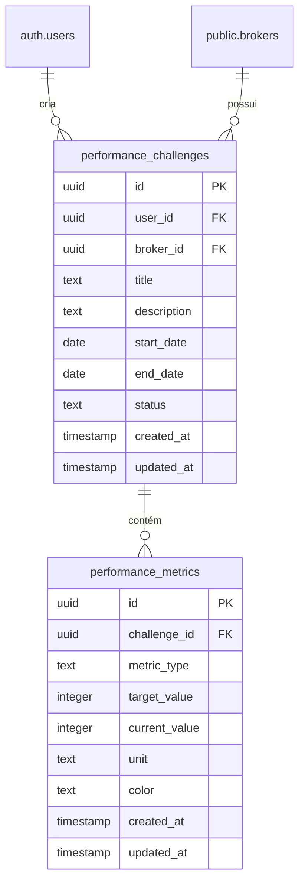
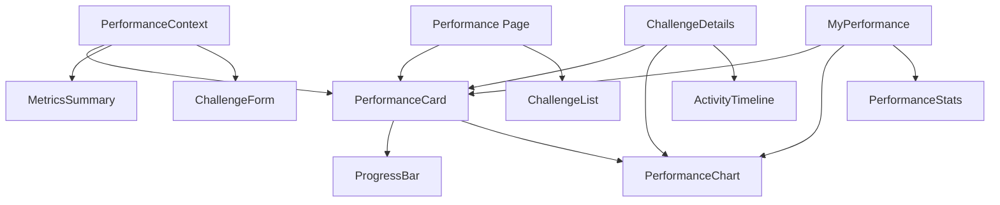

# Especificações Técnicas - Sistema de Desempenho com Barras de Progresso

## Visão Geral

Este documento descreve as especificações técnicas para implementação de um sistema de desempenho interativo com barras de progresso visuais para o Broker Wingman Pro. O sistema permitirá que gestores definam metas por período determinado para corretores, com acompanhamento visual do progresso baseado em atividades realizadas.

## 1. Especificações de Componentes

### 1.1 PerformanceCard

**Props:**
```typescript
interface PerformanceCardProps {
  challenge: PerformanceChallenge;
  brokerName?: string;
  showDetails?: boolean;
  onViewDetails?: (challenge: PerformanceChallenge) => void;
  onEdit?: (challenge: PerformanceChallenge) => void;
  onDelete?: (id: string) => void;
  variant?: 'default' | 'compact' | 'detailed';
}
```

**Estados e comportamentos:**
- Exibe informações principais do desafio de desempenho
- Calcula e exibe progresso total baseado em todas as métricas
- Indica visualmente status (ativo, concluído, expirado)
- Suporta diferentes variantes de visualização
- Responsivo com layouts adaptativos

**Integração com componentes existentes:**
- Utiliza `Card` do sistema UI existente
- Integrado com `Progress` para barras de progresso
- Utiliza ícones do Lucide React já configurados

### 1.2 ProgressBar (Estendida)

**Props:**
```typescript
interface ProgressBarProps extends React.ComponentProps<typeof Progress> {
  value: number;
  max?: number;
  label?: string;
  showPercentage?: boolean;
  color?: 'primary' | 'success' | 'warning' | 'error';
  animated?: boolean;
  size?: 'sm' | 'md' | 'lg';
}
```

**Estados e comportamentos:**
- Animações suaves de progresso
- Cores dinâmicas baseadas no percentual
- Labels informativos opcionais
- Tamanhos variáveis para diferentes contextos
- Suporte a múltiplas barras empilhadas

### 1.3 PerformanceChart (Gráfico de Pizza)

**Props:**
```typescript
interface PerformanceChartProps {
  data: PerformanceMetrics[];
  size?: 'sm' | 'md' | 'lg';
  showLegend?: boolean;
  showLabels?: boolean;
  animated?: boolean;
  onSegmentClick?: (metric: PerformanceMetrics) => void;
}
```

**Estados e comportamentos:**
- Renderização de gráfico de pizza interativo
- Cada tipo de atividade com cor distinta
- Animações de entrada e hover
- Legendas dinâmicas
- Responsivo com redimensionamento automático

### 1.4 MetricsSummary

**Props:**
```typescript
interface MetricsSummaryProps {
  metrics: PerformanceMetrics[];
  totalTarget: number;
  totalAchieved: number;
  period: string;
  compact?: boolean;
}
```

**Estados e comportamentos:**
- Exibição resumida de todas as métricas
- Cálculo automático de percentuais
- Indicadores visuais de status
- Layout responsivo
- Integração com sistema de notificações

### 1.5 ChallengeForm

**Props:**
```typescript
interface ChallengeFormProps {
  challenge?: PerformanceChallenge;
  brokers: Broker[];
  onSubmit: (data: ChallengeFormData) => Promise<void>;
  onCancel: () => void;
  isLoading?: boolean;
}
```

**Estados e comportamentos:**
- Formulário controlado para criação/edição
- Validação de campos em tempo real
- Configuração de múltiplas métricas
- Seleção de corretores
- Definição de períodos personalizados

## 2. Especificações de Contexto e API

### 2.1 PerformanceContext

**Interface completa:**
```typescript
interface PerformanceContextType {
  // Estado
  challenges: PerformanceChallenge[];
  metrics: PerformanceMetrics[];
  isLoading: boolean;
  error: string | null;
  
  // CRUD de Desafios
  createChallenge: (data: CreateChallengeData) => Promise<PerformanceChallenge>;
  updateChallenge: (id: string, data: Partial<PerformanceChallenge>) => Promise<PerformanceChallenge>;
  deleteChallenge: (id: string) => Promise<void>;
  getChallengeById: (id: string) => PerformanceChallenge | undefined;
  getChallengesByBrokerId: (brokerId: string) => PerformanceChallenge[];
  
  // Gestão de Métricas
  calculateProgress: (challengeId: string) => Promise<ProgressData>;
  updateMetrics: (challengeId: string) => Promise<void>;
  getMetricsByChallengeId: (challengeId: string) => PerformanceMetrics[];
  
  // Filtros e Consultas
  getActiveChallenges: () => PerformanceChallenge[];
  getCompletedChallenges: () => PerformanceChallenge[];
  getExpiredChallenges: () => PerformanceChallenge[];
  
  // Utilitários
  refreshChallenges: () => Promise<void>;
  exportChallengeReport: (challengeId: string) => Promise<Blob>;
}
```

**Tipos de dados:**
```typescript
interface PerformanceChallenge {
  id: string;
  userId: string;
  brokerId: string;
  title: string;
  description?: string;
  startDate: string;
  endDate: string;
  status: 'active' | 'completed' | 'expired' | 'cancelled';
  metrics: PerformanceMetrics[];
  createdAt: string;
  updatedAt: string;
}

interface PerformanceMetrics {
  id: string;
  challengeId: string;
  type: 'calls' | 'personal_visits' | 'office_visits' | 'listings' | 'sales' | 'tasks';
  targetValue: number;
  currentValue: number;
  unit: string;
  color: string;
}

interface ProgressData {
  totalProgress: number;
  metricsProgress: Record<string, number>;
  isCompleted: boolean;
  completedAt?: string;
}
```

### 2.2 Funções para CRUD de Desafios

**createChallenge:**
```typescript
const createChallenge = async (data: CreateChallengeData): Promise<PerformanceChallenge> => {
  // 1. Validar dados de entrada
  // 2. Inserir desafio na tabela performance_challenges
  // 3. Inserir métricas associadas
  // 4. Atualizar estado local
  // 5. Disparar notificações
  // 6. Retornar desafio criado
};
```

**updateChallenge:**
```typescript
const updateChallenge = async (id: string, data: Partial<PerformanceChallenge>): Promise<PerformanceChallenge> => {
  // 1. Validar permissões
  // 2. Atualizar dados na tabela
  // 3. Atualizar métricas se necessário
  // 4. Recalcular progresso
  // 5. Atualizar estado local
  // 6. Notificar mudanças
};
```

### 2.3 Lógica de Cálculo de Progresso e Pontos

**calculateProgress:**
```typescript
const calculateProgress = async (challengeId: string): Promise<ProgressData> => {
  // 1. Buscar métricas do desafio
  // 2. Para cada tipo de métrica, contar atividades correspondentes
  // 3. Calcular percentual por métrica
  // 4. Calcular progresso total (média ponderada)
  // 5. Verificar se está concluído
  // 6. Retornar dados de progresso
};
```

**Mapeamento de atividades para métricas:**
```typescript
const activityMapping = {
  calls: () => {
    // Contar atividades do tipo 'call' em meetings
    // ou em uma nova tabela de atividades
  },
  personal_visits: () => {
    // Contar meetings com tipo 'personal_visit'
  },
  office_visits: () => {
    // Contar meetings com tipo 'office_visit'
  },
  listings: () => {
    // Contar listings no período
  },
  sales: () => {
    // Contar sales no período
  },
  tasks: () => {
    // Contar tasks concluídas no período
  }
};
```

### 2.4 Integração com Contextos Existentes

**Integração com TasksContext:**
```typescript
// Utilizar useTasks() para contar tarefas concluídas
const calculateTaskMetrics = (brokerId: string, startDate: string, endDate: string) => {
  const tasks = tasksContext.getTasksByBrokerId(brokerId);
  return tasks.filter(task => 
    task.status === 'Concluída' &&
    task.dueDate >= startDate && 
    task.dueDate <= endDate
  ).length;
};
```

**Integração com MeetingsContext:**
```typescript
// Utilizar useMeetings() para contar visitas
const calculateVisitMetrics = (brokerId: string, startDate: string, endDate: string, visitType: string) => {
  const meetings = meetingsContext.getMeetingsByBrokerId(brokerId);
  return meetings.filter(meeting => 
    meeting.status === 'completed' &&
    meeting.meetingType === visitType &&
    meeting.meetingDate >= startDate && 
    meeting.meetingDate <= endDate
  ).length;
};
```

## 3. Especificações de Banco deDados

### 3.1 Schema Completo da Tabela performance_challenges

```sql
CREATE TABLE IF NOT EXISTS public.performance_challenges (
    id UUID DEFAULT gen_random_uuid() PRIMARY KEY,
    user_id UUID NOT NULL REFERENCES auth.users(id) ON DELETE CASCADE,
    broker_id UUID NOT NULL REFERENCES public.brokers(id) ON DELETE CASCADE,
    title TEXT NOT NULL,
    description TEXT,
    start_date DATE NOT NULL,
    end_date DATE NOT NULL,
    status TEXT NOT NULL DEFAULT 'active' CHECK (status IN ('active', 'completed', 'expired', 'cancelled')),
    created_at TIMESTAMP WITH TIME ZONE DEFAULT timezone('utc'::text, now()) NOT NULL,
    updated_at TIMESTAMP WITH TIME ZONE DEFAULT timezone('utc'::text, now()) NOT NULL
);
```

### 3.2 Schema da Tabela performance_metrics

```sql
CREATE TABLE IF NOT EXISTS public.performance_metrics (
    id UUID DEFAULT gen_random_uuid() PRIMARY KEY,
    challenge_id UUID NOT NULL REFERENCES public.performance_challenges(id) ON DELETE CASCADE,
    metric_type TEXT NOT NULL CHECK (metric_type IN ('calls', 'personal_visits', 'office_visits', 'listings', 'sales', 'tasks')),
    target_value INTEGER NOT NULL DEFAULT 0,
    current_value INTEGER NOT NULL DEFAULT 0,
    unit TEXT NOT NULL DEFAULT 'unidade',
    color TEXT NOT NULL DEFAULT '#3B82F6',
    created_at TIMESTAMP WITH TIME ZONE DEFAULT timezone('utc'::text, now()) NOT NULL,
    updated_at TIMESTAMP WITH TIME ZONE DEFAULT timezone('utc'::text, now()) NOT NULL
);
```

### 3.3 Índices Recomendados

```sql
-- Índices para performance_challenges
CREATE INDEX idx_performance_challenges_user_id ON public.performance_challenges(user_id);
CREATE INDEX idx_performance_challenges_broker_id ON public.performance_challenges(broker_id);
CREATE INDEX idx_performance_challenges_status ON public.performance_challenges(status);
CREATE INDEX idx_performance_challenges_dates ON public.performance_challenges(start_date, end_date);

-- Índices para performance_metrics
CREATE INDEX idx_performance_metrics_challenge_id ON public.performance_metrics(challenge_id);
CREATE INDEX idx_performance_metrics_type ON public.performance_metrics(metric_type);

-- Índice composto para consultas frequentes
CREATE INDEX idx_performance_challenges_user_broker_status 
    ON public.performance_challenges(user_id, broker_id, status);
```

### 3.4 Triggers para Sincronização Automática

```sql
-- Trigger para atualizar updated_at
CREATE TRIGGER set_performance_challenges_updated_at
    BEFORE UPDATE ON public.performance_challenges
    FOR EACH ROW
    EXECUTE FUNCTION public.handle_updated_at();

CREATE TRIGGER set_performance_metrics_updated_at
    BEFORE UPDATE ON public.performance_metrics
    FOR EACH ROW
    EXECUTE FUNCTION public.handle_updated_at();

-- Trigger para atualizar status automaticamente
CREATE OR REPLACE FUNCTION public.update_challenge_status()
RETURNS TRIGGER AS $$
BEGIN
    -- Verificar se todas as métricas foram alcançadas
    DECLARE
        all_completed BOOLEAN;
    BEGIN
        SELECT BOOL_AND(current_value >= target_value)
        INTO all_completed
        FROM public.performance_metrics
        WHERE challenge_id = NEW.id;
        
        -- Se todas completas e não expirou
        IF all_completed AND NEW.end_date >= CURRENT_DATE THEN
            NEW.status = 'completed';
        -- Se expirou e não completou
        ELSIF NEW.end_date < CURRENT_DATE AND NEW.status != 'completed' THEN
            NEW.status = 'expired';
        -- Se estava expirado mas foi completado
        ELSIF NEW.status = 'expired' AND all_completed THEN
            NEW.status = 'completed';
        END IF;
        
        RETURN NEW;
    END;
END;
$$ LANGUAGE plpgsql SECURITY DEFINER;

CREATE TRIGGER auto_update_challenge_status
    BEFORE UPDATE ON public.performance_challenges
    FOR EACH ROW
    EXECUTE FUNCTION public.update_challenge_status();
```

### 3.5 Relacionamentos com Tabelas Existentes



## 4. Especificações de Roteamento e Páginas

### 4.1 Novas Rotas Necessárias

```typescript
// Em App.tsx, adicionar após as rotas existentes:
<Route path="/performance" element={
  <ProtectedRoute allowedRoles={['manager', 'admin']}>
    <Performance />
  </ProtectedRoute>
} />
<Route path="/performance/new" element={
  <ProtectedRoute allowedRoles={['manager', 'admin']}>
    <NewChallenge />
  </ProtectedRoute>
} />
<Route path="/performance/:challengeId" element={
  <ProtectedRoute>
    <ChallengeDetails />
  </ProtectedRoute>
} />
<Route path="/performance/:challengeId/edit" element={
  <ProtectedRoute allowedRoles={['manager', 'admin']}>
    <EditChallenge />
  </ProtectedRoute>
} />
<Route path="/my-performance" element={
  <ProtectedRoute allowedRoles={['broker']}>
    <MyPerformance />
  </ProtectedRoute>
} />
```

### 4.2 Estrutura das Páginas

**Performance.tsx (Gestor)**
```typescript
export default function Performance() {
  // Lista todos os desafios de desempenho
  // Filtros por corretor, status, período
  // Cards resumidos com progresso
  // Ações: criar, visualizar, editar, excluir
  // Exportação de relatórios
}
```

**MyPerformance.tsx (Corretor)**
```typescript
export default function MyPerformance() {
  // Apenas desafios do corretor logado
  // Visualização detalhada do progresso
  // Gráficos e estatísticas
  // Histórico de desempenho
  // Sem permissão de edição
}
```

**ChallengeDetails.tsx**
```typescript
export default function ChallengeDetails() {
  // Detalhes completos de um desafio
  // Gráfico de pizza com progresso
  // Lista de atividades relacionadas
  // Timeline de progresso
  // Opções de edição (gestor)
}
```

**NewChallenge.tsx / EditChallenge.tsx**
```typescript
export default function NewChallenge() {
  // Formulário de criação/edição
  // Seleção de corretor
  // Configuração de métricas
  // Definição de período
  // Preview do desafio
}
```

### 4.3 Proteções de Rota e Permissões

```typescript
// Componente de proteção para gestores
const ManagerRoute = ({ children }: { children: React.ReactNode }) => (
  <ProtectedRoute allowedRoles={['manager', 'admin']}>
    {children}
  </ProtectedRoute>
);

// Componente de proteção para corretores
const BrokerRoute = ({ children }: { children: React.ReactNode }) => (
  <ProtectedRoute allowedRoles={['broker']}>
    {children}
  </ProtectedRoute>
);

// Verificação de permissão no componente
const canEditChallenge = (user: AuthUser, challenge: PerformanceChallenge) => {
  return user.role === 'admin' || 
         (user.role === 'manager' && challenge.userId === user.id);
};
```

## 5. Especificações de Estilo e Animações

### 5.1 Definições de Cores e Temas

**Cores para métricas (adicionar ao tailwind.config.ts):**
```typescript
colors: {
  // ... cores existentes
  'performance-calls': '#3B82F6',      // Azul
  'personal-visits': '#10B981',       // Verde
  'office-visits': '#F59E0B',         // Amarelo
  'listings': '#8B5CF6',              // Roxo
  'sales': '#EF4444',                 // Vermelho
  'tasks': '#06B6D4',                 // Ciano
}
```

**Classes CSS para progresso:**
```css
/* Adicionar ao index.css */
.progress-ring {
  transform: rotate(-90deg);
  transform-origin: 50% 50%;
}

.progress-segment {
  transition: all 0.3s ease-in-out;
}

.progress-segment:hover {
  filter: brightness(1.1);
  transform: scale(1.05);
}

@keyframes progressFill {
  from {
    stroke-dashoffset: 100;
  }
  to {
    stroke-dashoffset: var(--progress);
  }
}

.progress-animated {
  animation: progressFill 1s ease-out forwards;
}
```

### 5.2 Animações e Transições

**Animações de entrada:**
```typescript
// Framer motion ou CSS animations
const cardVariants = {
  hidden: { opacity: 0, y: 20 },
  visible: { 
    opacity: 1, 
    y: 0,
    transition: { duration: 0.3, ease: "easeOut" }
  }
};

const progressVariants = {
  hidden: { width: 0 },
  visible: (progress: number) => ({
    width: `${progress}%`,
    transition: { duration: 0.8, ease: "easeOut" }
  })
};
```

**Animações do gráfico de pizza:**
```typescript
const chartVariants = {
  hidden: { scale: 0.8, opacity: 0 },
  visible: {
    scale: 1,
    opacity: 1,
    transition: {
      duration: 0.5,
      ease: "easeOut",
      staggerChildren: 0.1
    }
  },
  segment: {
    hidden: { pathLength: 0 },
    visible: {
      pathLength: 1,
      transition: { duration: 0.8, ease: "easeInOut" }
    }
  }
};
```

### 5.3 Breakpoints Responsivos

```typescript
// Configurações responsivas
const responsiveConfig = {
  mobile: {
    chartSize: 200,
    cardColumns: 1,
    fontSize: 'sm'
  },
  tablet: {
    chartSize: 300,
    cardColumns: 2,
    fontSize: 'base'
  },
  desktop: {
    chartSize: 400,
    cardColumns: 3,
    fontSize: 'lg'
  }
};
```

### 5.4 Estados Visuais

**Estados de progresso:**
```css
.progress-empty { /* 0% */ }
.progress-low { /* 1-25% */ }
.progress-medium { /* 26-50% */ }
.progress-high { /* 51-75% */ }
.progress-almost { /* 76-99% */ }
.progress-complete { /* 100% */ }
```

**Estados de desafio:**
```css
.challenge-active { border-left: 4px solid #3B82F6; }
.challenge-completed { border-left: 4px solid #10B981; }
.challenge-expired { border-left: 4px solid #EF4444; }
.challenge-cancelled { border-left: 4px solid #6B7280; }
```

## 6. Plano de Implementação Detalhado

### 6.1 Ordem Recomendada de Implementação

**Fase 1: Infraestrutura (Semana 1)**
1. Criar migration do banco de dados
2. Implementar PerformanceContext básico
3. Criar tipos e interfaces
4. Configurar novas rotas

**Fase 2: Componentes Base (Semana 2)**
1. Implementar PerformanceCard
2. Criar ProgressBar estendida
3. Desenvolver MetricsSummary
4. Implementar layouts responsivos

**Fase 3: Visualização de Dados (Semana 3)**
1. Desenvolver PerformanceChart (gráfico de pizza)
2. Implementar animações e transições
3. Criar página de detalhes
4. Adicionar filtros e busca

**Fase 4: Formulários e CRUD (Semana 4)**
1. Implementar ChallengeForm
2. Criar páginas de criação/edição
3. Implementar validações
4. Adicionar notificações

**Fase 5: Integração e Refinamento (Semana 5)**
1. Integrar com contextos existentes
2. Implementar cálculo automático de métricas
3. Otimizar performance
4. Testes e correções

### 6.2 Dependências entre Componentes



### 6.3 Pontos de Integração Crítica

**Com TasksContext:**
```typescript
// Em PerformanceContext, adicionar useEffect para escutar mudanças
useEffect(() => {
  if (tasksContext.tasks.length > 0) {
    // Recalcular métricas de tarefas
    updateTaskMetrics();
  }
}, [tasksContext.tasks]);
```

**Com MeetingsContext:**
```typescript
// Similar para meetings
useEffect(() => {
  if (meetingsContext.meetings.length > 0) {
    // Recalcular métricas de visitas
    updateVisitMetrics();
  }
}, [meetingsContext.meetings]);
```

**Com SalesContext e ListingsContext:**
```typescript
// Integrar mudanças de vendas e captações
useEffect(() => {
  if (salesContext.sales.length > 0 || listingsContext.listings.length > 0) {
    // Recalcular métricas relacionadas
    updateSalesAndListingsMetrics();
  }
}, [salesContext.sales, listingsContext.listings]);
```

### 6.4 Estratégia de Testes

**Testes unitários:**
```typescript
// Testes para PerformanceContext
describe('PerformanceContext', () => {
  test('deve criar desafio corretamente', async () => {
    // Testar criação de desafio
  });
  
  test('deve calcular progresso corretamente', async () => {
    // Testar cálculo de progresso
  });
});

// Testes para componentes
describe('PerformanceCard', () => {
  test('deve renderizar informações corretamente', () => {
    // Testar renderização
  });
  
  test('deve exibir progresso correto', () => {
    // Testar cálculo de progresso no componente
  });
});
```

**Testes de integração:**
```typescript
// Teste de integração com contextos
describe('Integração com TasksContext', () => {
  test('deve atualizar métricas ao criar tarefa', async () => {
    // Testar integração
  });
});
```

**Testes E2E:**
```typescript
// Fluxo completo de criação e acompanhamento
describe('Fluxo de Desempenho', () => {
  test('gestor cria desafio e corretor visualiza', async () => {
    // Testar fluxo completo
  });
});
```

### 6.5 Considerações de Performance

**Otimizações:**
- Implementar cache para cálculos de métricas
- Utilizar React.memo para componentes pesados
- Implementar virtual scrolling para listas longas
- Carregar dados de forma paginada

**Monitoramento:**
- Adicionar logs para operações críticas
- Monitorar tempo de carregamento
- Rastrear erros de cálculo de métricas

## 7. Exemplos de Código

### 7.1 Exemplo de PerformanceCard

```typescript
import React from 'react';
import { Card, CardContent, CardHeader, CardTitle } from "@/components/ui/card";
import { Progress } from "@/components/ui/progress";
import { Badge } from "@/components/ui/badge";
import { PerformanceChart } from "./PerformanceChart";
import { PerformanceChallenge } from "@/contexts/PerformanceContext";

interface PerformanceCardProps {
  challenge: PerformanceChallenge;
  brokerName?: string;
  onViewDetails?: (challenge: PerformanceChallenge) => void;
}

export const PerformanceCard: React.FC<PerformanceCardProps> = ({ 
  challenge, 
  brokerName,
  onViewDetails 
}) => {
  const totalProgress = calculateTotalProgress(challenge.metrics);
  const statusColor = getStatusColor(challenge.status);
  
  return (
    <Card className="hover:shadow-lg transition-shadow cursor-pointer" 
          onClick={() => onViewDetails?.(challenge)}>
      <CardHeader className="pb-3">
        <div className="flex justify-between items-start">
          <div>
            <CardTitle className="text-lg">{challenge.title}</CardTitle>
            {brokerName && (
              <p className="text-sm text-muted-foreground">{brokerName}</p>
            )}
          </div>
          <Badge className={statusColor}>
            {challenge.status}
          </Badge>
        </div>
      </CardHeader>
      
      <CardContent className="space-y-4">
        <div className="flex items-center space-x-4">
          <div className="flex-1">
            <Progress value={totalProgress} className="h-2" />
            <p className="text-sm text-muted-foreground mt-1">
              {totalProgress.toFixed(1)}% concluído
            </p>
          </div>
          <div className="w-24 h-24">
            <PerformanceChart 
              data={challenge.metrics}
              size="sm"
              showLabels={false}
            />
          </div>
        </div>
        
        <div className="grid grid-cols-2 gap-2 text-sm">
          {challenge.metrics.map(metric => (
            <div key={metric.id} className="flex justify-between">
              <span className="text-muted-foreground">{metric.type}</span>
              <span className="font-medium">
                {metric.currentValue}/{metric.targetValue}
              </span>
            </div>
          ))}
        </div>
      </CardContent>
    </Card>
  );
};
```

### 7.2 Exemplo de PerformanceChart

```typescript
import React from 'react';
import { PieChart, Pie, Cell, ResponsiveContainer, Tooltip } from 'recharts';

interface PerformanceChartProps {
  data: PerformanceMetrics[];
  size?: 'sm' | 'md' | 'lg';
  showLegend?: boolean;
  showLabels?: boolean;
}

const COLORS = {
  calls: '#3B82F6',
  personal_visits: '#10B981',
  office_visits: '#F59E0B',
  listings: '#8B5CF6',
  sales: '#EF4444',
  tasks: '#06B6D4'
};

const getSize = (size: 'sm' | 'md' | 'lg') => {
  switch (size) {
    case 'sm': return 150;
    case 'md': return 250;
    case 'lg': return 350;
  }
};

export const PerformanceChart: React.FC<PerformanceChartProps> = ({
  data,
  size = 'md',
  showLegend = true,
  showLabels = true
}) => {
  const chartSize = getSize(size);
  
  const chartData = data.map(metric => ({
    name: metric.type,
    value: metric.currentValue,
    target: metric.targetValue,
    percentage: (metric.currentValue / metric.targetValue) * 100,
    color: COLORS[metric.type as keyof typeof COLORS]
  }));
  
  const renderCustomizedLabel = ({
    cx, cy, midAngle, innerRadius, outerRadius, percent
  }: any) => {
    if (!showLabels) return null;
    
    const RADIAN = Math.PI / 180;
    const radius = innerRadius + (outerRadius - innerRadius) * 0.5;
    const x = cx + radius * Math.cos(-midAngle * RADIAN);
    const y = cy + radius * Math.sin(-midAngle * RADIAN);

    return (
      <text 
        x={x} 
        y={y} 
        fill="white" 
        textAnchor={x > cx ? 'start' : 'end'} 
        dominantBaseline="central"
        className="text-xs font-medium"
      >
        {`${(percent * 100).toFixed(0)}%`}
      </text>
    );
  };

  return (
    <div className="w-full">
      <ResponsiveContainer width="100%" height={chartSize}>
        <PieChart>
          <Pie
            data={chartData}
            cx="50%"
            cy="50%"
            labelLine={false}
            label={renderCustomizedLabel}
            outerRadius={chartSize / 2 - 10}
            fill="#8884d8"
            dataKey="value"
            animationBegin={0}
            animationDuration={800}
          >
            {chartData.map((entry, index) => (
              <Cell key={`cell-${index}`} fill={entry.color} />
            ))}
          </Pie>
          <Tooltip 
            formatter={(value: any, name: any) => [
              `${value} unidades`, 
              name.charAt(0).toUpperCase() + name.slice(1)
            ]}
          />
        </PieChart>
      </ResponsiveContainer>
      
      {showLegend && (
        <div className="flex flex-wrap justify-center gap-2 mt-2">
          {chartData.map((entry, index) => (
            <div key={index} className="flex items-center gap-1">
              <div 
                className="w-3 h-3 rounded-full"
                style={{ backgroundColor: entry.color }}
              />
              <span className="text-xs text-muted-foreground">
                {entry.name}
              </span>
            </div>
          ))}
        </div>
      )}
    </div>
  );
};
```

### 7.3 Exemplo de PerformanceContext

```typescript
import React, { createContext, useContext, useEffect, useState, ReactNode } from 'react';
import { supabase } from "@/integrations/supabase/client";
import { useAuth } from './AuthContext';
import { useTasks } from './TasksContext';
import { useMeetings } from './MeetingsContext';
import { useSales } from './SalesContext';
import { useListings } from './ListingsContext';

// ... (interfaces já definidas anteriormente)

const PerformanceContext = createContext<PerformanceContextType | undefined>(undefined);

export const usePerformance = () => {
  const ctx = useContext(PerformanceContext);
  if (!ctx) throw new Error('usePerformance must be used within PerformanceProvider');
  return ctx;
};

export const PerformanceProvider: React.FC<{ children: ReactNode }> = ({ children }) => {
  const [challenges, setChallenges] = useState<PerformanceChallenge[]>([]);
  const [metrics, setMetrics] = useState<PerformanceMetrics[]>([]);
  const [isLoading, setIsLoading] = useState(true);
  const [error, setError] = useState<string | null>(null);
  
  const { user } = useAuth();
  const { tasks } = useTasks();
  const { meetings } = useMeetings();
  const { sales } = useSales();
  const { listings } = useListings();

  // Buscar desafios
  const fetchChallenges = async () => {
    if (!user) return;
    
    try {
      const { data, error } = await supabase
        .from('performance_challenges')
        .select('*')
        .eq('user_id', user.id)
        .order('created_at', { ascending: false });

      if (error) throw error;

      const mappedChallenges: PerformanceChallenge[] = (data || []).map(mapDatabaseToChallenge);
      setChallenges(mappedChallenges);
    } catch (err) {
      setError(err instanceof Error ? err.message : 'Erro ao buscar desafios');
    } finally {
      setIsLoading(false);
    }
  };

  // Buscar métricas
  const fetchMetrics = async () => {
    if (!user) return;
    
    try {
      const { data, error } = await supabase
        .from('performance_metrics')
        .select('*')
        .in('challenge_id', challenges.map(c => c.id));

      if (error) throw error;

      const mappedMetrics: PerformanceMetrics[] = (data || []).map(mapDatabaseToMetric);
      setMetrics(mappedMetrics);
    } catch (err) {
      setError(err instanceof Error ? err.message : 'Erro ao buscar métricas');
    }
  };

  // Criar desafio
  const createChallenge = async (data: CreateChallengeData): Promise<PerformanceChallenge> => {
    if (!user) throw new Error('Usuário não autenticado');

    // Inserir desafio
    const { data: newChallenge, error } = await supabase
      .from('performance_challenges')
      .insert({
        user_id: user.id,
        broker_id: data.brokerId,
        title: data.title,
        description: data.description,
        start_date: data.startDate,
        end_date: data.endDate
      })
      .select()
      .single();

    if (error) throw error;

    // Inserir métricas
    const metricsToInsert = data.metrics.map(metric => ({
      challenge_id: newChallenge.id,
      metric_type: metric.type,
      target_value: metric.targetValue,
      unit: metric.unit,
      color: metric.color
    }));

    const { data: newMetrics, error: metricsError } = await supabase
      .from('performance_metrics')
      .insert(metricsToInsert)
      .select();

    if (metricsError) throw metricsError;

    // Atualizar estado local
    const mappedChallenge = mapDatabaseToChallenge(newChallenge);
    const mappedMetrics = (newMetrics || []).map(mapDatabaseToMetric);
    
    setChallenges(prev => [mappedChallenge, ...prev]);
    setMetrics(prev => [...prev, ...mappedMetrics]);

    return mappedChallenge;
  };

  // Calcular progresso
  const calculateProgress = async (challengeId: string): Promise<ProgressData> => {
    const challenge = challenges.find(c => c.id === challengeId);
    if (!challenge) throw new Error('Desafio não encontrado');

    const challengeMetrics = metrics.filter(m => m.challengeId === challengeId);
    const metricsProgress: Record<string, number> = {};

    // Para cada métrica, calcular valor atual baseado nas atividades
    for (const metric of challengeMetrics) {
      const currentValue = await calculateMetricValue(
        metric.type,
        challenge.brokerId,
        challenge.startDate,
        challenge.endDate
      );
      
      metricsProgress[metric.type] = (currentValue / metric.targetValue) * 100;
      
      // Atualizar métrica no banco se necessário
      if (currentValue !== metric.currentValue) {
        await supabase
          .from('performance_metrics')
          .update({ current_value: currentValue })
          .eq('id', metric.id);
      }
    }

    // Calcular progresso total (média simples)
    const totalProgress = Object.values(metricsProgress).reduce((sum, progress) => sum + progress, 0) / Object.keys(metricsProgress).length;
    const isCompleted = Object.values(metricsProgress).every(progress => progress >= 100);

    return {
      totalProgress,
      metricsProgress,
      isCompleted,
      completedAt: isCompleted ? new Date().toISOString() : undefined
    };
  };

  // Calcular valor da métrica baseado nas atividades
  const calculateMetricValue = async (
    type: string,
    brokerId: string,
    startDate: string,
    endDate: string
  ): Promise<number> => {
    switch (type) {
      case 'tasks':
        return tasks.filter(task => 
          task.brokerId === brokerId &&
          task.status === 'Concluída' &&
          task.dueDate >= startDate &&
          task.dueDate <= endDate
        ).length;
      
      case 'personal_visits':
        return meetings.filter(meeting => 
          meeting.brokerId === brokerId &&
          meeting.meetingType === 'personal_visits' &&
          meeting.status === 'completed' &&
          meeting.meetingDate >= startDate &&
          meeting.meetingDate <= endDate
        ).length;
      
      case 'office_visits':
        return meetings.filter(meeting => 
          meeting.brokerId === brokerId &&
          meeting.meetingType === 'office_visits' &&
          meeting.status === 'completed' &&
          meeting.meetingDate >= startDate &&
          meeting.meetingDate <= endDate
        ).length;
      
      case 'listings':
        return listings.filter(listing => 
          listing.brokerId === brokerId &&
          listing.listingDate >= startDate &&
          listing.listingDate <= endDate
        ).length;
      
      case 'sales':
        return sales.filter(sale => 
          sale.brokerId === brokerId &&
          sale.saleDate >= startDate &&
          sale.saleDate <= endDate
        ).length;
      
      case 'calls':
        // Implementar lógica para chamadas (pode ser em meetings ou nova tabela)
        return 0;
      
      default:
        return 0;
    }
  };

  // Efeitos
  useEffect(() => {
    fetchChallenges();
  }, [user]);

  useEffect(() => {
    if (challenges.length > 0) {
      fetchMetrics();
    }
  }, [challenges]);

  // Recalcular métricas quando atividades mudam
  useEffect(() => {
    const recalculateAllMetrics = async () => {
      for (const challenge of challenges) {
        await calculateProgress(challenge.id);
      }
      await fetchMetrics(); // Refresh metrics after recalculation
    };

    if (tasks.length > 0 || meetings.length > 0 || sales.length > 0 || listings.length > 0) {
      recalculateAllMetrics();
    }
  }, [tasks, meetings, sales, listings]);

  const value: PerformanceContextType = {
    challenges,
    metrics,
    isLoading,
    error,
    createChallenge,
    updateChallenge: async (id, data) => { /* implementar */ },
    deleteChallenge: async (id) => { /* implementar */ },
    getChallengeById: (id) => challenges.find(c => c.id === id),
    getChallengesByBrokerId: (brokerId) => challenges.filter(c => c.brokerId === brokerId),
    calculateProgress,
    updateMetrics: async (challengeId) => { await calculateProgress(challengeId); },
    getMetricsByChallengeId: (challengeId) => metrics.filter(m => m.challengeId === challengeId),
    getActiveChallenges: () => challenges.filter(c => c.status === 'active'),
    getCompletedChallenges: () => challenges.filter(c => c.status === 'completed'),
    getExpiredChallenges: () => challenges.filter(c => c.status === 'expired'),
    refreshChallenges: fetchChallenges,
    exportChallengeReport: async (challengeId) => { /* implementar */ }
  };

  return (
    <PerformanceContext.Provider value={value}>
      {children}
    </PerformanceContext.Provider>
  );
};

// Funções auxiliares
const mapDatabaseToChallenge = (dbChallenge: any): PerformanceChallenge => ({
  id: dbChallenge.id,
  userId: dbChallenge.user_id,
  brokerId: dbChallenge.broker_id,
  title: dbChallenge.title,
  description: dbChallenge.description,
  startDate: dbChallenge.start_date,
  endDate: dbChallenge.end_date,
  status: dbChallenge.status,
  metrics: [], // Será preenchido depois
  createdAt: dbChallenge.created_at,
  updatedAt: dbChallenge.updated_at
});

const mapDatabaseToMetric = (dbMetric: any): PerformanceMetrics => ({
  id: dbMetric.id,
  challengeId: dbMetric.challenge_id,
  type: dbMetric.metric_type,
  targetValue: dbMetric.target_value,
  currentValue: dbMetric.current_value,
  unit: dbMetric.unit,
  color: dbMetric.color
});

const calculateTotalProgress = (metrics: PerformanceMetrics[]): number => {
  if (metrics.length === 0) return 0;
  const totalProgress = metrics.reduce((sum, metric) => {
    const progress = (metric.currentValue / metric.targetValue) * 100;
    return sum + Math.min(progress, 100);
  }, 0);
  return totalProgress / metrics.length;
};

const getStatusColor = (status: string): string => {
  switch (status) {
    case 'active': return 'bg-blue-500';
    case 'completed': return 'bg-green-500';
    case 'expired': return 'bg-red-500';
    case 'cancelled': return 'bg-gray-500';
    default: return 'bg-gray-500';
  }
};
```

## Conclusão

Este documento fornece especificações técnicas completas para implementação do sistema de desempenho com barras de progresso. As especificações abrangem desde a estrutura do banco de dados até os componentes visuais, passando por contextos, rotas e animações.

A implementação deve seguir a ordem recomendada no plano de implementação, garantindo que cada fase seja concluída antes de prosseguir para a próxima. A integração com os contextos existentes é crucial para o funcionamento correto do sistema, e deve ser testada minuciosamente.

O sistema foi projetado para ser extensível, permitindo a adição de novos tipos de métricas e funcionalidades no futuro sem grandes modificações na arquitetura existente.